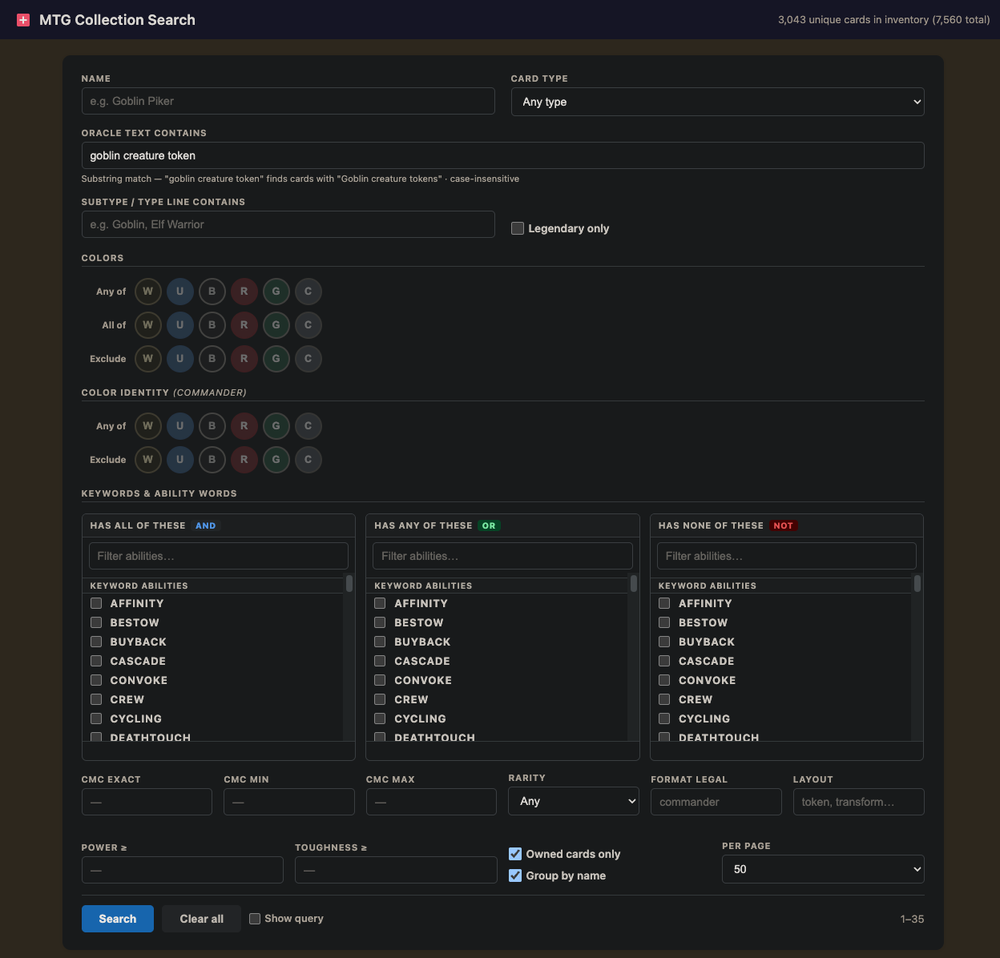
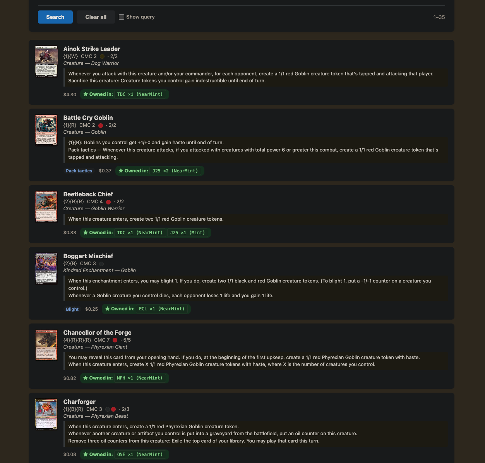
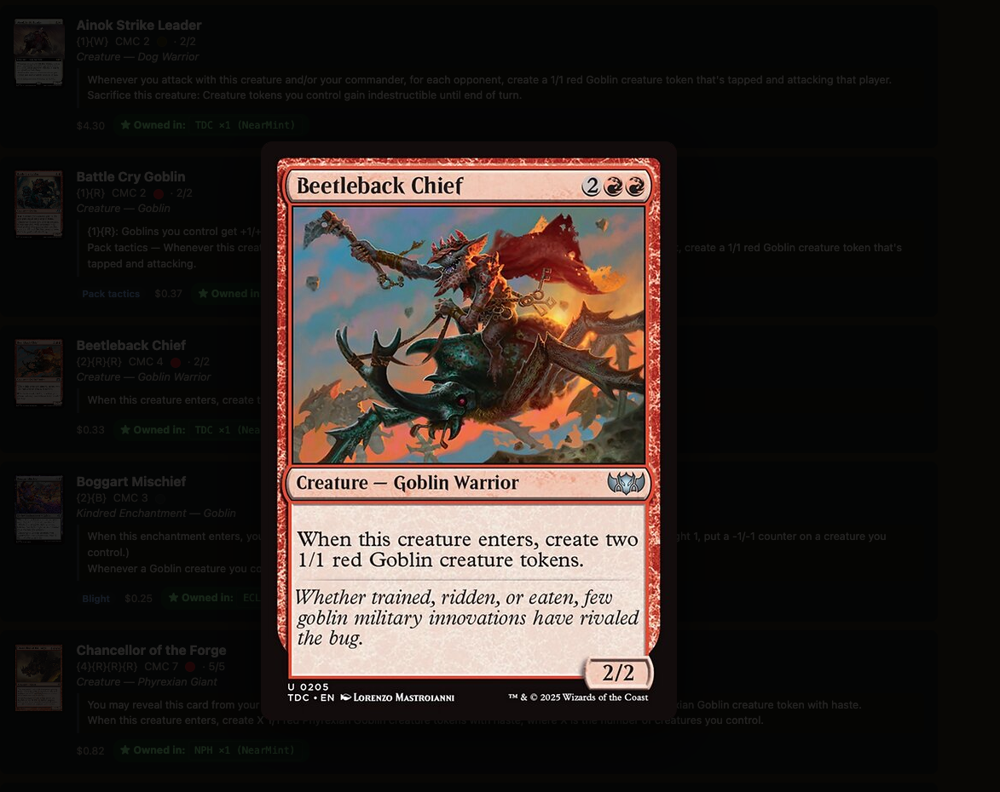
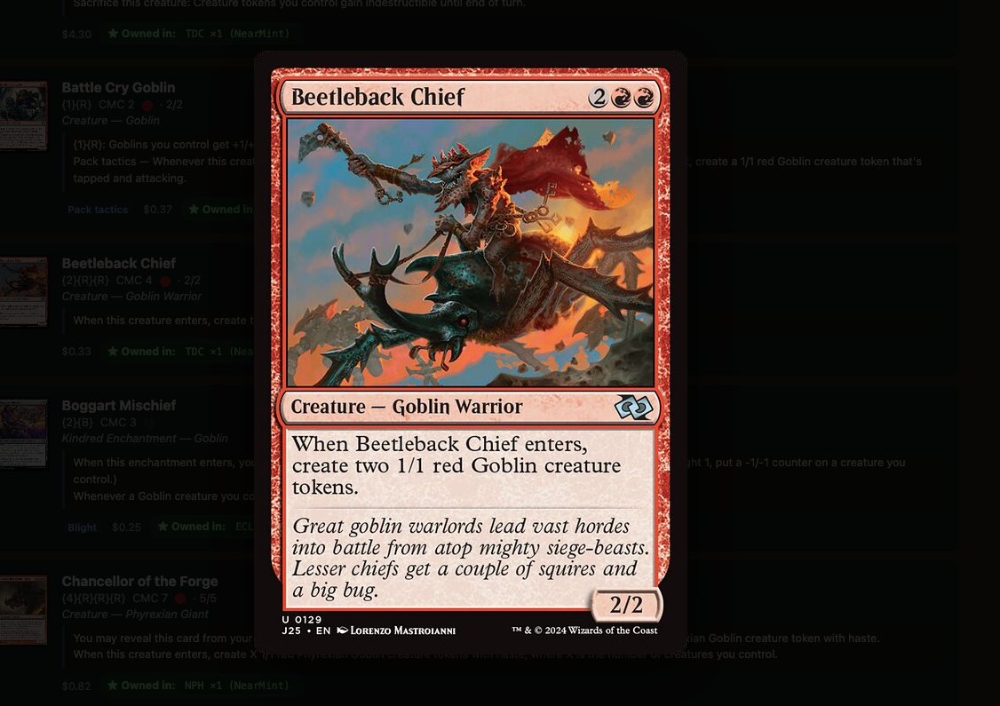

# MTG Collection Search

Search your Magic: The Gathering card collection by color, type, oracle text, keywords, mana cost, and more. Powered by [Scryfall bulk data](https://scryfall.com/docs/api/bulk-data) and SQLite.

## Features

- Color filtering with Any / All / Exclude logic (e.g. "all of R, W, U but not G")
- Oracle text search — reliable substring match (e.g. "goblin creature token" finds sorceries, instants, enchantments)
- Card type dropdown (Creature, Instant, Sorcery, Artifact, Enchantment, Land, Planeswalker, etc.)
- Legendary supertype filter
- Keyword ability filtering (Flying, Haste, Deathtouch, Cycling, etc.)
- Inventory tracking — mark cards as owned and filter by your collection
- Paginated results with configurable page size
- Click any card to pop up the full card image; click an edition badge to see that specific printing
- CLI and local web UI, both backed by the same search engine

---

## Screenshots

### Search screen


### Search results


### Edition popup — clicking an edition badge shows that printing's card image



---

## Prerequisites

- **[Bun](https://bun.sh)** — TypeScript runtime with built-in SQLite. No separate Node or database install needed.

```bash
curl -fsSL https://bun.sh/install | bash
# then restart your terminal
```

---

## Setup

### 1. Install dependencies

```bash
cd mtg-details
bun install
```

### 2. Download the Scryfall card database

Scryfall publishes a free bulk export of every card. First, find the current download URL:

```bash
curl -s https://api.scryfall.com/bulk-data | jq '.data[] | select(.type=="default_cards") | .download_uri'
```

Download that file and put it in the `allCards/` folder. It must be named `default-cards-*.json` (the default Scryfall filename, e.g. `default-cards-20260101120000.json`). The import script always picks the most recent file in that folder.

**What it is:** A JSON array of ~90,000 card objects. Each object has at minimum:

| Field | Example | Used for |
|---|---|---|
| `id` | `"abc123..."` | Unique Scryfall ID, used as the inventory FK |
| `name` | `"Lightning Bolt"` | Display and search |
| `set` | `"m11"` | Set code (lowercase) |
| `collector_number` | `"149"` | Matches inventory CSV |
| `colors`, `color_identity` | `["R"]` | Color filtering |
| `keywords` | `["Flying"]` | Keyword filtering |
| `oracle_text` | `"Deal 3 damage..."` | Oracle text search |
| `image_uris.normal` | `"https://..."` | Card thumbnail and popup |
| `prices.usd` | `"0.49"` | Price display |

Double-faced cards (transform, modal) may omit top-level `oracle_text` and `mana_cost` — the importer falls back to `card_faces[0]` automatically.

> **Tip:** Re-download and re-import monthly to keep prices and new sets current.

### 3. Import cards into the local database

```bash
bun run import-cards
```

This parses all cards into `mtg.db`. It uses ~2 GB of RAM temporarily while loading the JSON — this is normal and frees up after import. Takes 15–30 seconds.

### 4. Import your inventory

Export your collection as a CSV from your card management app and place it in the `inventory/` folder. The script always picks the alphabetically latest `.csv` in that folder.

**Supported apps:** Dragon Shield Card Manager, Manabox, Deckbox, or any app whose export matches this column layout.

**Required CSV columns** (the importer matches cards by set code + collector number):

| Column | Example | Notes |
|---|---|---|
| `Card Name` | `Abandon Hope` | Used for display and unmatched-card warnings |
| `Set Code` | `TMP` | Case-insensitive; matched against Scryfall `set` field |
| `Card Number` | `107` | Collector number; must match Scryfall exactly |
| `Quantity` | `2` | Defaults to 1 if missing or blank |

**Optional columns** (imported if present, safe to omit):

`Trade Quantity`, `Condition`, `Printing`, `Language`, `Price Bought`, `Date Bought`, `LOW`, `MID`, `MARKET`

**Example CSV** (Dragon Shield format — the `"sep=,"` header line is stripped automatically):

```
"sep=,"
Folder Name,Quantity,Trade Quantity,Card Name,Set Code,Set Name,Card Number,Condition,Printing,Language,Price Bought,Date Bought,LOW,MID,MARKET
Cards,1,0,Abandon Hope,TMP,Tempest,107,NearMint,Normal,English,0.05,2025-09-20,0.10,0.32,0.23
Cards,2,0,Lightning Bolt,M11,Magic 2011,149,Excellent,Normal,English,0.49,2025-10-01,0.35,0.55,0.49
```

```bash
bun run import-inventory
```

After a trade or new purchase, drop in a fresh export and re-run — it wipes and rebuilds the inventory table in under a second. Cards that don't match a Scryfall entry (wrong set code or collector number) are saved but flagged in the output and won't appear in `--owned` searches.

> **Note on set codes:** Scryfall distinguishes closely related products with separate set codes. For example, *Magic: The Gathering Foundations* is `FDN` and *Foundations Jumpstart* is `J25`. If your inventory app exports them under the same code, some cards may not match. Check flagged output after import.

---

## Running the UI

```bash
bun run ui
```

Then open **http://localhost:3001** in your browser.

### Filters

| Filter | Description |
|---|---|
| Name | Card name contains (case-insensitive) |
| Card type | Structured dropdown: Creature, Instant, Sorcery, Artifact, Enchantment, Land, Planeswalker, Battle, and common subtypes (Equipment, Aura, Saga, Vehicle) |
| Legendary only | Limits results to cards with the Legendary supertype |
| Oracle text contains | Substring match on oracle text — "goblin creature token" finds any card whose oracle text contains that string, including plurals like "tokens" |
| Subtype / type line contains | Free-text match against the full type line (e.g. "Elf Warrior") |
| Colors / Color Identity | Click W/U/B/R/G buttons to filter; toggle Any / All / Exclude per group |
| Keywords | Pick keyword abilities (Flying, Haste, etc.) or ability words (Landfall, Morbid, etc.) |
| CMC, Rarity, Format, Layout | Standard stat filters |
| Power ≥ / Toughness ≥ | Numeric minimum (cards with * or X count as 0) |
| Owned cards only | Show only cards present in your inventory (default: on) |
| Group by name | Collapse all printings into one row per card name (default: on) |
| Per page | Results per page: 25 / 50 / 100 / 200 |

### Group by name

Checking **Group by name** collapses multiple printings of the same card into one result. Instead of showing a separate row for each set a card was printed in, you get one row with an "Owned in: TMP ×3 (NearMint), USG ×1 (LP)" summary. Useful when you want to find cards that do something without wading through 20 reprints.

### Card image popup

Click any card result to see a full-size popup of the card image. In **Group by name** mode, each edition badge (e.g. "FDN ×2 (Mint)") is also clickable — clicking it opens the image for that specific printing rather than the default one.

### Image caching

The dark toolbar below the header controls local image caching. By default images load directly from Scryfall's CDN each time; enabling caching saves them to disk so they load instantly on subsequent views and work offline.

| Control | Description |
|---|---|
| **Cache images** checkbox | Toggles caching on/off. Preference is saved across sessions. |
| **Size selector** | Which sizes to cache: Both (~112 KB/card), Small only (~12 KB), or Normal only (~100 KB). Small = card thumbnails in results; Normal = full popup image. |
| **Cache stats** | Live display of how many files are cached and total disk usage. |
| **Clear small / Clear normal / Clear all** | Deletes the selected cache tier from disk immediately. |
| **⬇ Download all owned** | Pre-caches every card in your inventory at once, in batches, with progress shown inline. Useful before going offline. |

**Storage estimates:**

| Scenario | Small (~12 KB/card) | Normal (~100 KB/card) | Both |
|---|---|---|---|
| All ~90k printings in DB | ~1.1 GB | ~9 GB | ~10 GB |
| All owned cards (~2,000) | ~24 MB | ~200 MB | ~224 MB |
| One 50-card results page | ~600 KB | ~5 MB | ~5.6 MB |

On-demand caching (images save as you browse) is the most practical approach — storage grows gradually and stays well under 1 GB for a typical collection.

**File naming:** Images are stored as `image_cache/small/{uuid}.jpg` and `image_cache/normal/{uuid}.jpg` using the Scryfall card UUID. If you have images downloaded from another tool that uses Scryfall UUIDs, drop them into the correct subfolder and the app will serve them without re-downloading. The `image_cache/` directory is gitignored.

> **No official Scryfall bulk image download exists.** To pre-populate the cache manually, you can run a script against the DB: `SELECT id, image_normal FROM cards WHERE image_normal IS NOT NULL` gives all source URLs.

### Sort

Three-level sort controls appear at the bottom of the search form. Each level has a column dropdown and an Asc/Desc toggle.

| Sort option | Description |
|---|---|
| Name | Alphabetical |
| Mana Cost (CMC) | Numeric; X spells sort as 0 |
| Type | Alphabetical on type line |
| Color | By color bitmask — colorless → mono W/U/B/R/G → multicolor |
| Rarity | Common → Uncommon → Rare → Mythic |
| Set / Edition | By release date |
| Price † | By price_usd at time of last Scryfall import |
| Qty Owned | Most copies first when descending |
| Power / Toughness | Numeric; `*` and `X` sort as 0 |

† Price reflects the value recorded during the last `bun run import-cards`, not live market price.

### Debug panel

Check **Show query** before searching to reveal the raw SQL and parameters the server generated. Useful for diagnosing unexpected results.

### Pagination

Use **Prev** / **Next** to page through results. The header shows the inventory totals (unique card names and total quantity) independently of the search limit.

---

## CLI search

```bash
bun run search -- [flags]
bun run search -- --help
```

### Color filters

Colors are entered as comma-separated letters: `W` `U` `B` `R` `G` `C`

| Flag | Behavior | Example |
|---|---|---|
| `--colors-any` | Has at least one of these colors | `--colors-any R,W` |
| `--colors-all` | Has all of these colors | `--colors-all R,W,U` |
| `--colors-not` | Has none of these colors | `--colors-not G,B` |
| `--ci-any` | Color identity has any of (Commander) | `--ci-any R,W` |
| `--ci-all` | Color identity has all of | `--ci-all R,W,U` |
| `--ci-not` | Color identity excludes | `--ci-not G` |

### Text filters

| Flag | Behavior |
|---|---|
| `--name <text>` | Name contains (case-insensitive) |
| `--type <text>` | Type line contains (e.g. `Goblin`, `Instant`) |
| `--main-type <type>` | Card type: Creature, Instant, Sorcery, Artifact, Enchantment, Land, Planeswalker, Equipment, Aura, Saga, Vehicle, Battle |
| `--legendary` | Only Legendary cards |
| `--text <fts>` | Full-text search over oracle text, type line, and name — see FTS syntax below |

### Keyword abilities

`--keyword` only matches cards that *have* the named ability — not cards whose text mentions it. For everything else (ability words, triggered abilities, flavor text), use `--text`.

| Flag | Behavior | Example |
|---|---|---|
| `--keyword <kw>` | Has this keyword ability (repeatable, ANDed) | `--keyword Flying --keyword Deathtouch` |
| `--keyword-not <kw>` | Lacks this keyword ability (repeatable) | `--keyword-not Trample` |

**What counts as a keyword:** Named abilities from the MTG rules — evergreen ones like Flying, Haste, Deathtouch, Lifelink, Trample, Vigilance, First Strike, Hexproof, Indestructible, Menace, Reach, Flash, Ward, Defender; and mechanic keywords like Cycling, Kicker, Flashback, Equip, Convoke, Delve, Cascade, Morph, Escape, Crew, Mutate, Prowess, Explore, and many more.

**What is not a keyword:** Ability words (Landfall, Morbid, Threshold), triggered/activated abilities described as sentences, or abilities that *grant* keywords to other cards. Use `--text` for those.

### Stat filters

| Flag | Behavior |
|---|---|
| `--cmc <n>` | Exact converted mana cost |
| `--cmc-min <n>` | CMC greater than or equal to |
| `--cmc-max <n>` | CMC less than or equal to |
| `--rarity <r>` | `common` / `uncommon` / `rare` / `mythic` |
| `--format <f>` | Legal in format (e.g. `commander`, `modern`, `legacy`) |
| `--layout <l>` | Card layout: `normal`, `token`, `transform`, `split`, etc. |
| `--power-min <n>` | Power ≥ n (numeric cards only; cards with `*` are ignored) |
| `--toughness-min <n>` | Toughness ≥ n |

### Inventory & output

| Flag | Behavior |
|---|---|
| `--owned` | Only show cards present in your inventory |
| `--unique` | Collapse printings — one result per card name, owned sets listed inline |
| `--limit <n>` | Max results to return (default 50, max 500) |

---

## Full-text search syntax (CLI `--text` flag)

The `--text` flag accepts SQLite FTS5 query syntax:

```bash
# Exact phrase
--text '"goblin token"'

# Either wording (handles old vs. new card text)
--text '"goblin token" OR "goblin creature token"'

# Both words must appear somewhere in the text (AND is the default)
--text 'flying trample'

# Must have "flying" but not "trample"
--text 'flying NOT trample'

# Prefix match — finds "goblin", "goblins", "goblinoid"
--text 'goblin*'
```

FTS searches across the card name, type line, and oracle text simultaneously.

> **Note:** The web UI uses a simpler substring match for oracle text (more reliable for everyday searches). Use the CLI `--text` flag when you need boolean operators or prefix matching.

---

## CLI examples

```bash
# All red or white cards you own
bun run search -- --colors-any R,W --owned

# Cards with all of R, W, U but not green
bun run search -- --colors-all R,W,U --colors-not G

# Sorceries that create Goblin tokens
bun run search -- --text '"goblin creature token*"' --main-type Sorcery

# Creatures with flying and deathtouch, legal in Commander
bun run search -- --keyword Flying --keyword Deathtouch --type Creature --format commander

# Cheap aggressive red/white creatures (CMC ≤ 2, not green/blue/black)
bun run search -- --colors-any R,W --colors-not G,U,B --cmc-max 2 --type Creature --owned

# All tokens in your collection
bun run search -- --layout token --owned

# High-power creatures you own (power 5 or greater)
bun run search -- --type Creature --power-min 5 --owned --limit 200

# Legendary creatures legal in Commander
bun run search -- --main-type Creature --legendary --format commander --owned
```

---

## Keeping data current

| What changed | Command |
|---|---|
| You traded / bought / sold cards | Re-export CSV from your app → `bun run import-inventory` |
| A new MTG set released | Download new Scryfall bulk file → `bun run import-cards` |
| Prices are stale | Same as above — Scryfall prices update daily in the bulk export |

Both import commands are fully idempotent — they wipe and rebuild the relevant table, so you can run them as many times as you want.

---

## How the search works

Colors are stored as a bitmask integer (W=1, U=2, B=4, R=8, G=16, C=32). This makes color queries a single CPU instruction per row — no JSON parsing, no string splitting.

```
--colors-any R,W  →  (color_bits & 9) != 0
--colors-all R,W  →  (color_bits & 9) = 9
--colors-not G    →  (color_bits & 16) = 0
```

Oracle text is indexed in a SQLite FTS5 virtual table for the CLI's `--text` flag. The UI's oracle text field uses a direct `LIKE` substring match, which is more predictable for everyday searches.

Keywords are normalized into a separate `card_keywords` table (one row per card per keyword) so each `--keyword` filter is a fast EXISTS lookup rather than a JSON parse.

---

## Project structure

```
mtg-details/
├── allCards/               Scryfall bulk JSON (gitignored due to size)
├── img/                    Screenshots for this README
├── inventory/              Your exported card CSVs (gitignored)
├── public/
│   └── index.html          Single-file web UI
├── src/
│   ├── db.ts               SQLite schema, connection, color utilities
│   ├── query.ts            Query builder — shared by CLI and server
│   ├── import-cards.ts     Loads Scryfall JSON → mtg.db
│   ├── import-inventory.ts Loads inventory CSV → mtg.db
│   ├── search.ts           CLI search tool
│   └── server.ts           Local HTTP server for the UI
├── mtg.db                  SQLite database (gitignored, generated by imports)
├── package.json
└── tsconfig.json
```

---

## License

MIT — see [LICENSE](LICENSE).
